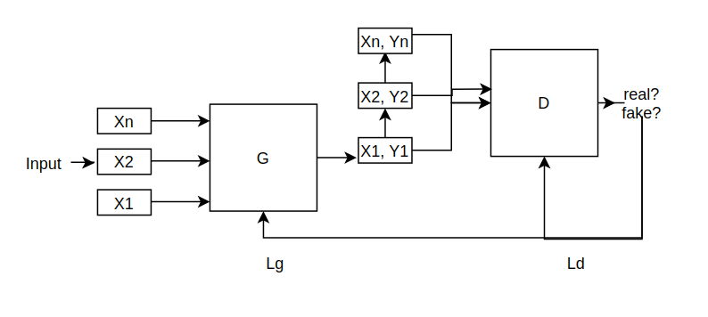
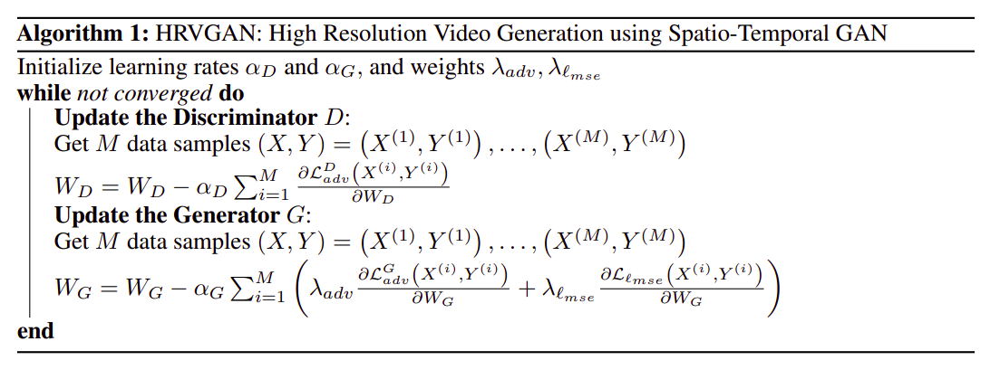
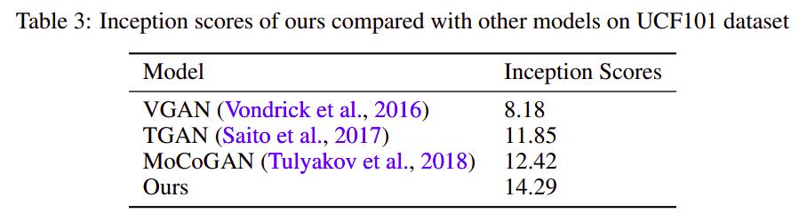
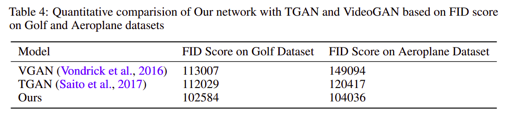
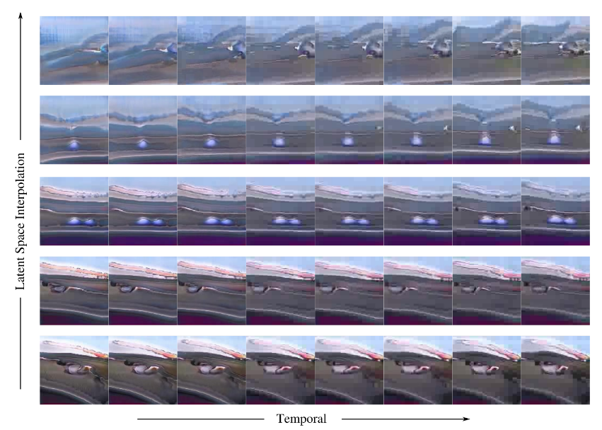

# HRVGAN: High Resolution Video Generation using Spatio-Temporal GAN
Code for the paper `HRVGAN: High Resolution Video Generation using Spatio-Temporal GAN`

https://arxiv.org/pdf/2008.09646

## Abstract

In this paper, we present a novel network for high resolution video generation. Our
network uses ideas from Wasserstein GANs by enforcing k-Lipschitz constraint
on the loss term and Conditional GANs using class labels for training and testing.
We present Generator and Discriminator network layerwise details along with the
combined network architecture, optimization details and algorithm used in this
work. Our network uses a combination of two loss terms: mean square pixel loss
and an adversarial loss. The datasets used for training and testing our network
are UCF101, Golf and Aeroplane Datasets. Using Inception Score and Fréchet
Inception Distance as the evaluation metrics, our network outperforms previous
state of the art networks on unsupervised video generation.

## Data

The following datasets were used in this work for training and testing our network for video generation:

1. UCF101 Dataset: The purpose of this dataset was training networks robust for action recognition
tasks. It contains 13320 videos of 101 different action categories like Sky Diving, Knitting and
Baseball Pitch.
2. Golf and Aeroplane Datasets: It contains 128×128 resolution frames which can be used for
evaluating video generative adversarial networks.

## Network Architecture



## Algorithm



## Train

`python train.py`

## Results





Linear interpolation in latent space to generate samples from Golf dataset


Linear interpolation in latent space to generate samples from Aeroplane dataset



Results on UCF-101 generated from random noise. For each task, we display 8 frames of
our generated videos for the JumpingJack (1st row) and TaiChi (2nd row)


## Citing

If you find this code useful in your research, please consider citing the paper:

BibTex:

```
@article{sagar2020hrvgan,
  title={HRVGAN: High Resolution Video Generation using Spatio-Temporal GAN},
  author={Sagar, Abhinav},
  journal={arXiv preprint arXiv:2008.09646},
  year={2020}
}
```

APA:

`Sagar, A. (2020). HRVGAN: High Resolution Video Generation using Spatio-Temporal GAN. arXiv preprint arXiv:2008.09646.`

## License

```
MIT License

Copyright (c) 2020 Abhinav Sagar

Permission is hereby granted, free of charge, to any person obtaining a copy
of this software and associated documentation files (the "Software"), to deal
in the Software without restriction, including without limitation the rights
to use, copy, modify, merge, publish, distribute, sublicense, and/or sell
copies of the Software, and to permit persons to whom the Software is
furnished to do so, subject to the following conditions:

The above copyright notice and this permission notice shall be included in all
copies or substantial portions of the Software.

THE SOFTWARE IS PROVIDED "AS IS", WITHOUT WARRANTY OF ANY KIND, EXPRESS OR
IMPLIED, INCLUDING BUT NOT LIMITED TO THE WARRANTIES OF MERCHANTABILITY,
FITNESS FOR A PARTICULAR PURPOSE AND NONINFRINGEMENT. IN NO EVENT SHALL THE
AUTHORS OR COPYRIGHT HOLDERS BE LIABLE FOR ANY CLAIM, DAMAGES OR OTHER
LIABILITY, WHETHER IN AN ACTION OF CONTRACT, TORT OR OTHERWISE, ARISING FROM,
OUT OF OR IN CONNECTION WITH THE SOFTWARE OR THE USE OR OTHER DEALINGS IN THE
SOFTWARE.
```


